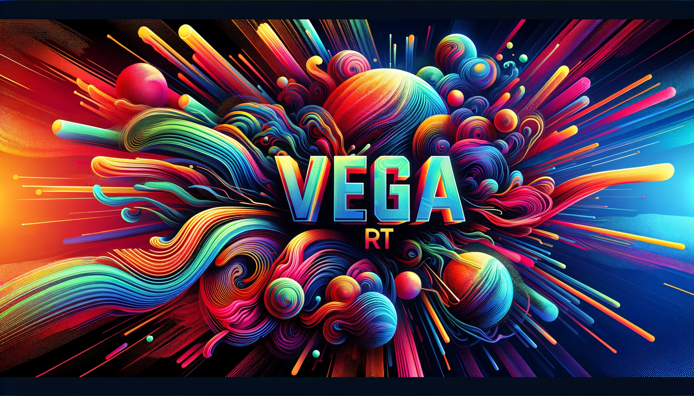

# Segmind Vega Real time TTI in Streamlit

Realtime image generation using segmind vega RT latent consistency adapter and streamlit + streamlit-keyup




## Demo Video

This demo assumes you have torch and CUDA properly installed for your machine.

[demo_video.webm](https://github.com/tdolan21/vega-rt-streamlit/assets/40906019/79994ceb-b859-4e8f-8dfc-26392466fcfe)

Demo uses just under 16GB of VRAM


## Features

### Downloadable Images

+ **Instant Download**: Once you're satisfied with the generated image, you can effortlessly download it. This feature ensures that you can save your creations directly from the session state, preserving the quality and details of the image.

### Efficient Storage Strategy

+ **Selective Storage**: To optimize storage usage, not every image is stored permanently. However, each generated image is meticulously tracked.
+ **Session State Tracking**: Every image is assigned a unique identifier (UUID) and timestamped when stored in the session state. This approach facilitates easy tracking and organization of your images.

### Export Option

+ **Session Analysis**: For those interested in analyzing the progression of their prompts, the application provides an option to export the entire session state. This feature allows for a comprehensive review of your creative journey.

## Installation

Follow these simple steps to set up the project on your local machine:

```bash
git clone https://github.com/tdolan21/vega-rt-streamlit
cd vega-rt-streamlit
pip install -r requirements.txt
```

This will ensure that all necessary libraries and dependencies are correctly installed, setting up the environment for smooth operation.

## Usage

To use the application, simply run the following command in your terminal:


```
streamlit run app.py
```

This command will start the Streamlit server and open the application in your default web browser. Enjoy exploring the features and functionalities of the application with ease.

## More information 

[Model-Card](https://huggingface.co/segmind/Segmind-VegaRT)
